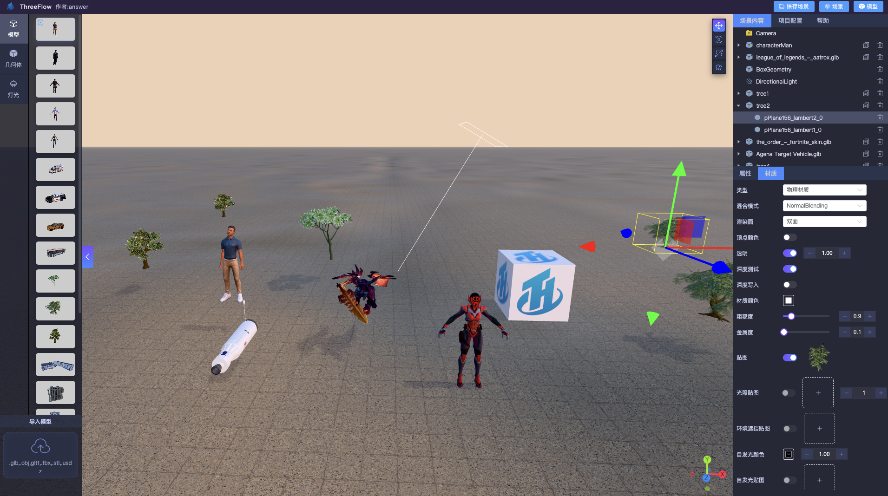
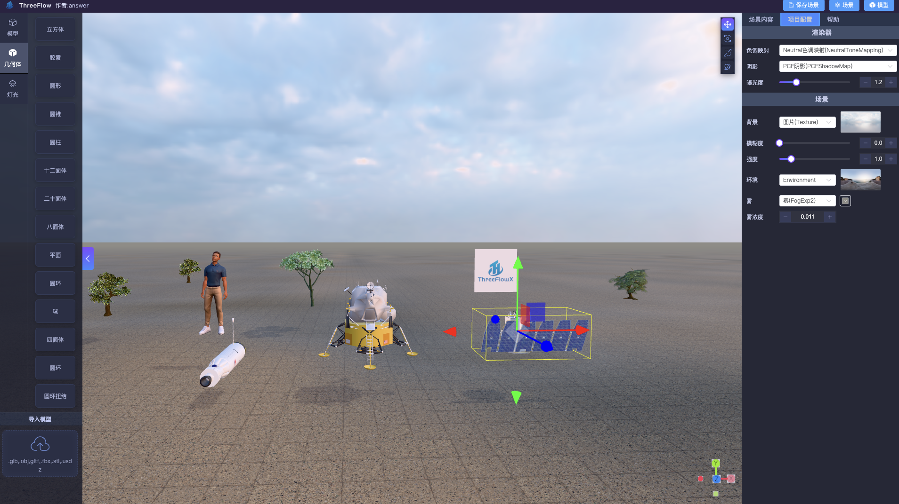

### 项目名称：ThreeFlow(3D场景编辑器) [English](README.en.md)

<a href='https://gitee.com/ZHANG_6666/three-flow/stargazers'></img></a> 
<a href='https://gitee.com/ZHANG_6666/three-flow/members'></img></a>
<a target="_black" href="https://github.com/zhangbo126/ThreeFlow">

</a><a target="_black" href="https://github.com/zhangbo126/ThreeFlow">

</a>
<a target="_black" href="https://space.bilibili.com/284991231">

</a>

### 项目描述

ThreeFlow:一个基于 `Three.js+Vue3+Vite+Typescript `实现的3D场景编辑器。

项目采用企业级开发标准，集成 `ESLint` + `Stylelint` + `Prettier` + `Husky` + `CommitLint` 确保代码质量保障体系。

对Three.js核心操作模块的功能进行单独模块化抽离封装，降低Three.js在前端现代框架（Vue3）中的开发成本。

### 🌐 安装/启动/打包(详见 package.json)

```
 pnpm install

 pnpm serve 
 
 pnpm build/pnpm build:pro

```

### 💚  支持项目 ⭐

如果你觉得该项目对你有帮助那就留个star吧，这是对作者每次熬夜牺牲休息时间去更新开源项目最大的动力支持

### 🎵 主要技术栈

| 名称                     | 版本    | 名称         | 版本  |
| ------------------------ | ------- | ------------ | ----- |
| Vue                      | 3.5.13  | Typescript   | 5.7.x |
| Vite                     | 6.1.x   | Element-plus | 2.9.4 |
| Three                   | 182     | Pinia        | 2.3.x |
| TWEEN                   | 18.5.0  | 详见 `package.json` | 🤗    |

### 🌺 开发环境

| 名称 | 版本    | 名称    | 版本   |
| ---- | ------- | ------- | ------ |
| node | 21.3.0  | npm     | 10.2.4 |
| yarn | 1.22.21 | windows | 10     |
| pnpm | 9.15.1  | mac     | M1-M4  |

### ⚖️ 许可协议

本项目基于 **AGPL-3.0** 开源协议发布。

**您可以：**
- ✅ **自由使用**：用于个人学习、研究或商业项目。
- ✅ **二次开发**：根据需求自由修改源代码。

**但您必须遵守以下义务：**
- ❗ **开源义务**：如果您修改了代码并通过网络提供服务（如 SaaS 网站、Web 应用），**必须向该服务的所有用户公开完整的源代码**。
- ❗ **保留声明**：必须保留原作者的版权声明(项目logo、项目名称、作者名称等)和协议说明。

**⚠️若有因您本人不遵守协议导致造成的一切损失，将由您本人承担**

### 📚 商用Pro版（ThreeFlowX）


**ThreeFlowX（3D低代码场景编辑器）：** 在保留了 *ThreeFlow* 所有功能的基础上，提供更加丰富多态的3D场景元素内容和更加强大的低代码自定义能力，以及优秀的性能处理和更加灵活便捷的操作。同时也提供了多模型、大场景资源的加载/渲染/存储的解决方案。

<!-- Start of Selection -->
**[在线文档](http://threeflowx.cn/docs/)**:<http://threeflowx.cn/docs/>

**[在线地址](http://threeflowx.cn/edit/)**:<http://threeflowx.cn/edit/>
<!-- End of Selection -->

###  项目界面




### 👷 项目目录结构介绍

### 1. 入口文件

- App.vue : 应用程序的根组件，包含路由视图
- main.js : 应用程序入口文件，负责初始化 Vue 应用、注册全局组件、全局状态、指令和插件

### 2. /assets 目录

存放静态资源文件：

- iconFont/ : 阿里巴巴矢量图标库文件（地址: <https://www.iconfont.cn/）>
- image/ : 图片资源
- previewIcon/ : 模型预览图片
- textures/ : 资源贴图文件

### 3. /components 目录

全局组件文件：

- Loading/ : 自定义封装的页面加载loading
- index.ts : 组件导出文件

### 4. /config 目录

常量配置和静态数据配置文件：

- constant.ts :  常量定义
- defaultDragList.ts : 左侧模型拖拽资源内容数据
- propertyConfig.ts : 静态属性配置项

### 5. /enums 目录

全局枚举文件：

- enum.ts : 场景、变换控制器、材质等相关枚举定义
- indexDb.ts : IndexedDB 数据库相关枚举

### 6. /layouts 目录

布局组件文件：

- RenderView.vue : 渲染视图布局组件，作为应用的主要承载容器

### 7. /router 目录

路由配置文件：

- index.ts : Vue Router 路由配置入口，定义应用页面导航规则

### 8. /store 目录

Pinia 状态管理文件：

- indexDbStore.ts : IndexedDB 数据操作状态管理
- pinia.ts : Pinia 实例初始化配置
- sceneEditStore.ts : 场景编辑器核心状态管理（包括场景对象、选中状态等）

### 9. /style 目录

样式资源文件：

- iconFont.scss : 字体图标样式定义
- index.scss : 全局通用样式入口
- reset.scss : 浏览器默认样式重置

### 10. /types 目录

TypeScript 类型定义文件：

- global.d.ts : 全局通用类型声明
- indexDbTypes.ts : IndexedDB 数据结构类型定义
- renderModelTypes.ts : 渲染模型相关接口定义
- rightPanelTypes.ts : 右侧属性面板配置类型定义
- three-css3d.d.ts : CSS3D 渲染器类型声明
- three-utils.d.ts : Three.js 工具函数类型声明

### 11. /utils 目录

核心工具函数与逻辑封装：

- directive.ts : Vue 自定义指令注册
- globalComponent.ts : 全局组件自动注册逻辑
- globalProperties.ts : Vue 全局属性挂载
- historyModules/ : 操作历史记录（撤销/重做）模块封装
- indexedDB.ts : IndexedDB 数据库操作封装类
- renderScene.ts : **核心文件**，Three.js 场景渲染逻辑封装（初始化、渲染循环、事件监听等）
- sceneModules/ : 场景功能模块（灯光、动画、变换控制等）
- utils.ts : 通用辅助函数


### 12. /views 目录

页面视图文件：

- sceneEdit/ : 3D 场景编辑器主视图
  - index.vue : 编辑器入口组件
  - layouts/ : 编辑器内部布局组件（左侧拖拽栏、右侧属性面板、顶部工具栏等）

